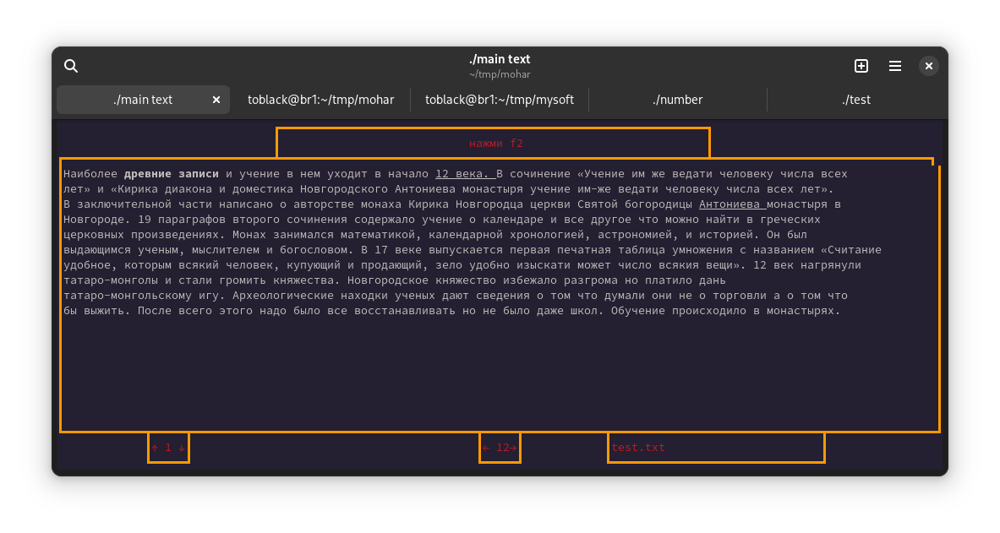

<h1 aligh="center">Программа для просмотра .txt файлов</h1>
<h3 aligh="center">Ну и математический способ Древних Русов есть</h3>



# Зачем?
Я написал программу для проекта в колледже.

# Почему?
Потому что.

# Работа с программой
Интерфейс поддерживает только русский язык. Управление понятное, нажав на f1 можно вызвать вспомогательное окно.

## Компиляция
Для компиляции требуется скачать make, сам компилятор g++ и библиотеку ncurses. Для каждого дистрибутива по разному, обращайтесь в свою документацию 
```
make
```

## Использование
Программе надо скормить путь к текстовым документам
```
./main /home/user/Documents
```
Дальше программа все сделает сама

# Как это работает
Программа делится на несколько этапов. Сначала идет иницилизация текстовых файлов, затем слов из первого файла, и линии что бы можно было делать скролинг аля less. 
